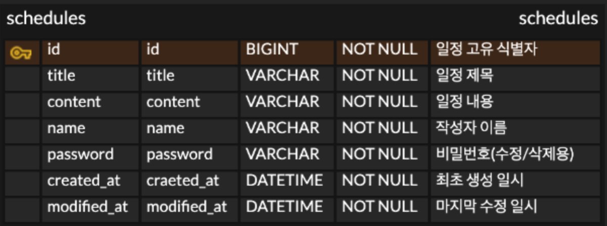

# 일정 관리 앱 만들기

## 프로젝트 개요
Spring Boot와 JPA를 기반으로 구현된 간단한 일정 관리 앱만들기.
사용자는 일정을 등록, 조회, 수정, 삭제할 수 있으며, 수정과 삭제는 비밀번호 검증을 통해 이루어집니다.

##  기술 스택
- **Language:** Java
- **Framework:** Spring Boot
- **Data:** Spring Data JPA
- **Database:** MySQL

---

## API 명세서 

### 1. 일정 등록 
새로운 일정을 생성합니다.
- **URL:** `/schedules`
- **Method:** `POST`
- **Request Body (JSON)**

| 필드명 | 타입 | 필수 여부 | 설명 |
| :--- | :--- | :---: | :--- |
| `title` | String | O | 일정 제목 |
| `content` | String | O | 일정 내용 |
| `name` | String | O | 작성자 이름 |
| `password`| String | O | 비밀번호 (수정/삭제 시 검증용) |

- **Response (200 OK)**

```json
{
  "id": 1,
  "title": "일정등록",
  "content": "등록된 일정",
  "name": "강재구",
  "createAt": "2026-04-14T08:00:00",
  "modifiedAt": "2026-04-14T08:00:00"
}
```

### 2. 일정 전체 조회 
등록된 모든 일정을 조회합니다. 파라미터로 작성자 이름을 넘기면 해당 작성자의 일정만 필터링합니다. (수정일 기준 내림차순 정렬)
- **URL:** `/schedules`
- **Method:** `GET`
- **Query Parameter**

| 파라미터명 | 타입 | 필수 여부 | 설명 |
| :--- | :--- | :---: | :--- |
| `name` | String | X | 특정 작성자 이름으로 필터링 |

- **Response (200 OK)**: 일정 객체의 배열 (List)

```json
[
  {
    "id": 1,
    "title": "일정등록",
    "content": "등록된 일정",
    "name": "강재구",
    "createAt": "2026-04-14T08:00:00",
    "modifiedAt": "2026-04-14T08:00:00"
  }
]
```

### 3. 단일 일정 조회 
특정 ID의 일정 상세 정보를 조회합니다.
- **URL:** `/schedules/{id}`
- **Method:** `GET`
- **Path Variable**
    - `id` (Long): 조회할 일정의 고유 ID
- **Response (200 OK)**

```json
{
  "id": 1,
  "title": "일정등록",
  "content": "등록된 일정",
  "name": "강재구",
  "createAt": "2026-04-14T08:00:00",
  "modifiedAt": "2026-04-14T08:00:00"
}
```

### 4. 일정 수정 
선택한 일정을 수정합니다. 기존에 등록한 비밀번호가 일치해야 합니다.
- **URL:** `/schedules/{id}`
- **Method:** `PUT`
- **Path Variable**
    - `id` (Long): 수정할 일정의 고유 ID
- **Request Body (JSON)**

| 필드명 | 타입 | 필수 여부 | 설명 |
| :--- | :--- | :---: | :--- |
| `title` | String | O | 수정할 제목 |
| `name` | String | O | 수정할 이름 |
| `password`| String | O | 기존에 등록한 비밀번호 |

- **Response (200 OK)**

```json
{
  "id": 1,
  "title": "수정된 제목",
  "name": "수정된 이름",
  "createAt": "2026-04-14T08:00:00",
  "modifiedAt": "2026-04-14T09:30:00"
}
```

### 5. 일정 삭제 
선택한 일정을 삭제합니다. 기존에 등록한 비밀번호가 일치해야 합니다.
- **URL:** `/schedules/{id}`
- **Method:** `DELETE`
- **Path Variable**
    - `id` (Long): 삭제할 일정의 고유 ID
- **Request Body (JSON)**

| 필드명 | 타입 | 필수 여부 | 설명 |
| :--- | :--- | :---: | :--- |
| `password`| String | O | 기존에 등록한 비밀번호 |

- **Response (200 OK)**: 본문 없음


##  ERD

### Entity Relationship Diagram
